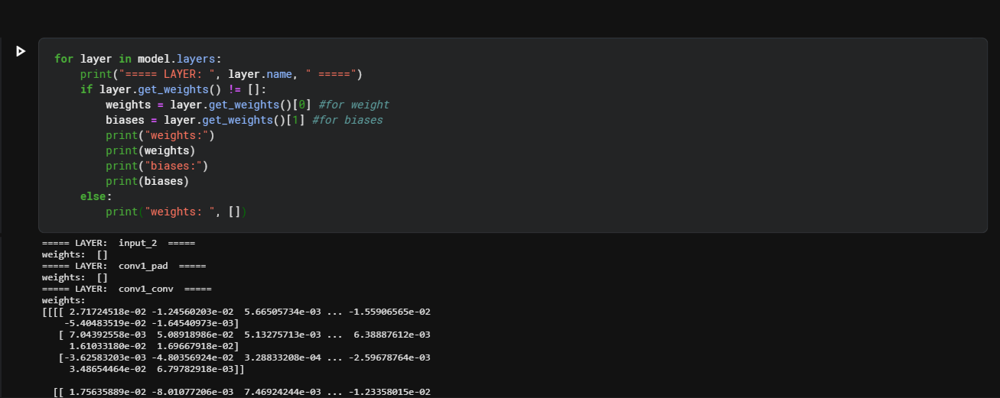

######  PRUNING TECHNIQUES
-------------------------------------------------------
What is pruning?
- A techniques of removing unimportant parameters(weights, biases,  acivations) of deep neural network.
--------------------------------------------------------
Why?
1. Reduction in storage.
2. speed-up during testing
--------------------------------------------------------

Types of pruning:
1. Weight pruning 
2. Neuron pruning 

Code Snippet to get the weight details of each layers:
----------------------------------------------------------
